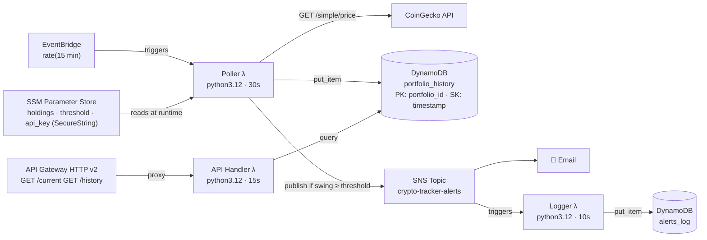

# Crypto Portfolio Tracker — Architecture & Decisions

## Architecture

> All three Lambdas run under the pre-existing **LabRole** (Learner Lab blocks new IAM resource creation).  
> CloudWatch monitors Poller errors (`> 0`) and duration (`> 25,000 ms`) via metric alarms.

---

## Three Architecture Decisions

**D1 — DynamoDB over RDS (Cost)**  
RDS wins on ad-hoc SQL and joins, but costs ~$15–25/month at idle even with zero traffic. The data model is a pure time-series keyed on `portfolio_id + timestamp` — no joins ever needed — so DynamoDB `PAY_PER_REQUEST` is the right fit: zero cost at rest and no capacity to provision.

**D2 — HTTP API Gateway v2 over REST API v1 (Cost + Simplicity)**  
REST API v1 wins on request validation, usage plans, and WAF integration, but costs $3.50/M requests vs HTTP API's $1.00/M. With two read-only proxy routes and no auth complexity required, HTTP API delivers identical Lambda proxy behaviour at 71% lower cost and half the Terraform surface area.

**D3 — SSM Parameter Store over plain environment variables (Security)**  
Plain env vars are visible in the Lambda console and baked into `terraform.tfstate` in clear text. SSM `SecureString` encrypts the CoinGecko API key at rest via KMS, allows rotation without redeployment, and the standard tier is free. Non-sensitive config (holdings, threshold) stays as plain `String` params — right-sizing the security mechanism.
